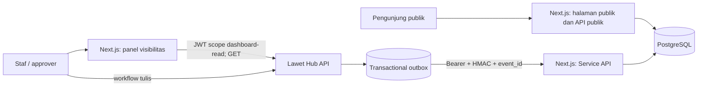

# Arsitektur ALAS

ALAS adalah aplikasi Next.js 14 dengan App Router yang memisahkan pengalaman arsip publik, panel visibilitas terautentikasi, API publik, dan Service API integrasi. PostgreSQL adalah penyimpanan lokal untuk data arsip yang diterbitkan.

## Batas Sistem

| Area | Lokasi | Tanggung jawab |
| --- | --- | --- |
| Routing dan endpoint | `src/app/` | Page App Router, route handler, dan layout panel. |
| Tampilan halaman | `src/views/`, `src/widgets/` | Susunan UI tingkat halaman dan komposisi multi-entitas. |
| Fitur | `src/features/` | Filter jurnal, autentikasi dan visibilitas Lawet Hub, serta sinkronisasi Service API. |
| Entitas | `src/entities/` | Query, model, public API, dan UI untuk `jurnal`, `pimpinan`, `lawet-user`, serta `site-settings`. |
| Shared | `src/shared/` | Koneksi basis data, design tokens, dan komponen yang dipakai lintas area. |
| Persistensi | `drizzle/` | Skema dan migrasi Drizzle. |

Alias TypeScript `@/*` menunjuk ke `src/*`. Urutan layer adalah `app → views → widgets → features → entities → shared`; layer bawah tidak boleh mengimpor layer di atas dan satu feature tidak boleh mengimpor feature lain. Client component memakai suffix `.client.tsx`. Barrel `index.ts` hanya digunakan sebagai public API pada `entities` atau `shared`; aturan public API telah ditegakkan untuk `entities/lawet-user`, `entities/pimpinan`, serta `entities/site-settings`.

## Alur Data

### Arsip publik

Halaman `/` menggunakan `LandingView`, yang membaca endpoint publik. Route handler publik hanya mengembalikan jurnal yang layak tampil, menyaring lampiran berdasarkan `is_public`, dan mengubah foto gambar pertama menjadi `thumbnail_url`.

Endpoint publik yang tersedia:

| Endpoint | Fungsi |
| --- | --- |
| `GET /api/jurnal` | Daftar jurnal dengan pencarian, kategori, tanggal, dan cursor pagination. |
| `GET /api/jurnal/:id` | Detail jurnal publik. |
| `GET /api/jurnal/calendar?month=YYYY-MM` | Tanggal yang memiliki kegiatan. |
| `GET /api/jurnal/stats?year=YYYY` | Rekap kategori dan tahun yang tersedia. |
| `GET /api/jurnal/kategori` | Daftar kategori jurnal dari Lawet Hub API dengan fallback database lokal ALAS. |
| `GET /api/pimpinan?date=YYYY-MM-DD` | Pimpinan aktif untuk suatu tanggal. |
| `GET /api/pimpinan/:id` | Detail pimpinan. |
| `GET /api/health` | Pemeriksaan koneksi database dan uptime proses. |

### Workflow authoring dan persetujuan

Layout grup rute `(authoring)` dan panel memanggil `getMeAction`. Sesuai [ADR-0008](../adr/0008-alas-access-gate-and-dynamic-kategori-sync.md), proses login (`loginAction`) dan verifikasi sesi (`getMeAction`) menegakkan pengecekan hak akses ALAS (`has_alas_access: true`, `feature_access.jurnal_alas: true`, atau `is_superadmin: true`). Pengguna Lawet Hub tanpa hak akses ALAS ditolak pada saat login dan tidak dapat memegang sesi aktif. Token sesi Lawet Hub disimpan sebagai cookie HTTP-only bernama `lawet_token`. Pengunjung tanpa sesi dialihkan ke `/login`; halaman `/approval` dijaga pada server berdasarkan capability `can_approve`, dengan fallback kompatibilitas untuk peran `level >= 2`.

ALAS menampilkan draf dan jurnal terbit milik pengguna, antrean persetujuan, serta jurnal terbit bawahan dalam cakupan divisi approver. Alur authoring dan tindakan persetujuan (approve/reject) memanggil REST API terpusat Lawet Hub secara langsung (ADR-0005), dan persetujuan yang disetujui memicu pengiriman proyeksi publik ke ALAS melalui Direct Service API. Keputusan arsitektur ini tercatat di [ADR-0005](../adr/0005-centralized-lawet-hub-approval-workflow.md) dan [ADR-0008](../adr/0008-alas-access-gate-and-dynamic-kategori-sync.md).

### Service API

Route di `src/app/api/service/` menerima bearer service token. Semua operasi tulis juga wajib membawa `X-ALAS-Event-Id`, `X-ALAS-Timestamp`, dan `X-ALAS-Signature`. Signature HMAC-SHA256 meliputi timestamp, method, path, dan hash body; replay dibatasi oleh `ALAS_REPLAY_WINDOW_SECONDS`. Event diklaim dalam transaksi yang sama dengan mutasi, sehingga retry outbox tidak menerapkan event dua kali. Upsert jurnal/pimpinan memakai `source_id` unik dan `ON CONFLICT` atomik.

Lawet Hub mencatat desired state ke transactional outbox. Worker mengirimnya dengan timeout serta exponential backoff dari env, dan reconciliation berkala mengantrekan ulang proyeksi yang seharusnya published, draft setelah unpublish, atau deleted. Keputusan lengkap ada di [ADR-0001](../adr/0001-direct-service-delivery-guarantees.md).

Kontrak payload, header, status respons, retry, dan reconciliation berada di [INTEGRATION.md](INTEGRATION.md). Saat kontrak berubah, producer, consumer, test, dan dokumen integrasi harus diperbarui dalam perubahan yang sama.

## Repository Isolation

ALAS dan Lawet Hub adalah deployable mandiri. Integrasi lintas sistem hanya melalui HTTP dan konfigurasi environment; repository tidak boleh mengimpor source, memasang package, memakai `file:`/`link:` dependency, symlink eksternal, atau Git submodule dari repository pasangannya.

`npm run boundary:check` memindai source, manifest, link filesystem, dan metadata Git. `npm run boundary:test` membuktikan fixture yang sah diterima dan dependency silang ditolak. `npm run arch:check` menjalankan boundary check lalu dependency-cruiser untuk arah layer FSD dan aturan public API.

## Konfigurasi dan Infrastruktur

- `DATABASE_URL` menghubungkan aplikasi ke PostgreSQL.
- `ALAS_SERVICE_TOKEN` mengamankan Service API dan harus sama dengan konfigurasi pengirim di Lawet Hub.
- `ALAS_WEBHOOK_SECRET` menandatangani write Direct Service dan harus berbeda dari bearer token.
- `ALAS_REPLAY_WINDOW_SECONDS` menentukan toleransi usia timestamp signature.
- `LAWET_API_URL` hanya dipakai server-side untuk login dan pembacaan visibilitas Lawet Hub.
- `LAWET_PUBLIC_URL` adalah origin Lawet Hub yang dapat dibuka browser untuk workflow tulis.
- `LAWET_REQUEST_TIMEOUT_MS` membatasi waktu tunggu proxy media terlindungi.
- ALAS tidak menyimpan credential write untuk database atau MinIO Lawet Hub.
- Docker Compose menjalankan `alas-db`, `alas-app`, dan `alas-nginx` pada jaringan `alas-net`; Nginx adalah reverse proxy untuk aplikasi Next.js.

Panduan operasional ada di [RUNBOOK.md](../ops/RUNBOOK.md), sedangkan struktur data di [ERD.md](ERD.md).
